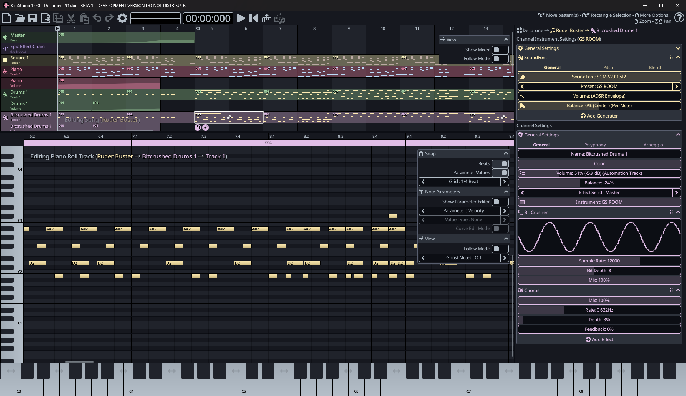
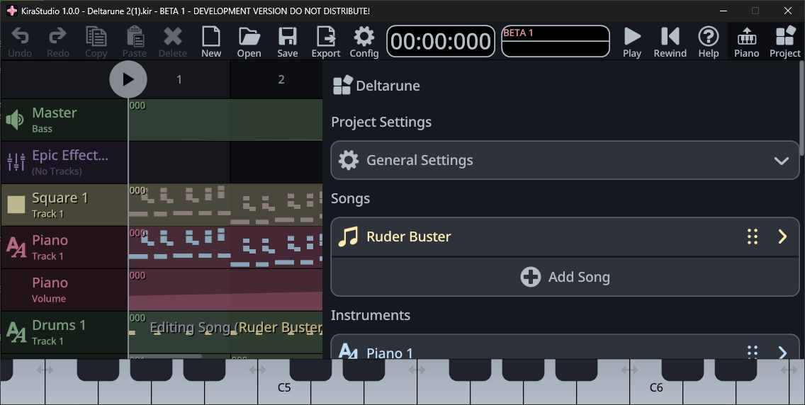

# Controls

## Basic Desktop Controls

Most of the operations are performed with the mouse. In general:

* The **Left mouse button** adds and removes stuff. 
    * **Single-clicking** add notes/patterns.
    * **Double-clicking** deletes notes/patterns.
* The **Light mouse button** opens context menus and selects things.
    * **Right-clicking** quickly will open a context menu.
    * **Right-clicking + holding and dragging** will select a range of notes or patterns in the piano roll or sequencer.
* The **Middle mouse button** is used for navigation:
    * **Middle-clicking + holding and dragging** will pan the viewport.
    * **Rotating the mouse wheel** will zoom the viewport in/out.

If you are working on a trackpad, please check out how to enable [Trackpad controls](config.md#input-configuration) in the configuration dialog.

## Basic Mobile Controls

On mobile, there are 3 main gestures used:

* A **Quick Tap** will usually add stuff such as pattern, notes or vertices on a curve. 
* A **Swipe** will pan the viewport around.
* A **Long Press** on something will reveal advanced options or start a rectangular selection. In some cases where multiple actions can be performed (selection and contextual menu), a pulsing circle will appears to give you a choice.

# Main Window

- Active channel (explain that this is what piano plays)
- Main Window
	- Links to various sections.

=== "Desktop"
    
=== "Mobile"
    
